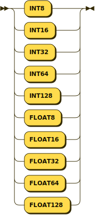
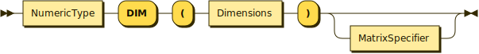
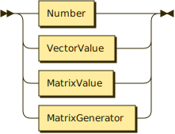
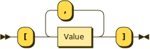
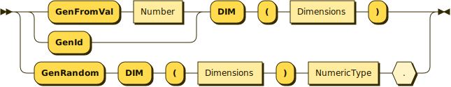
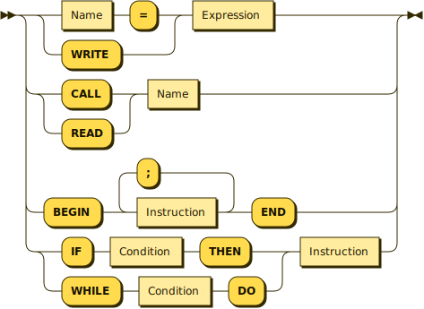
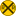

**Program:**


```
Program  ::= 'PROGRAM' Name ':' Block '.'
```

**Block:**


```
Block    ::= ( 'CONST' Type Name '=' Value ( ',' Name '=' Value )* ';' )* ( 'VAR' Type Name ( ',' Name )* ';' )* ( 'PROCEDURE' Name ';' Block ';' )* Instruction
```

referenced by:

* Block
* Program

**Type:**


```
Type     ::= NumericType
           | VectorizedType
```

referenced by:

* Block

**NumericType:**



```
NumericType
         ::= 'INT8'
           | 'INT16'
           | 'INT32'
           | 'INT64'
           | 'INT128'
           | 'FLOAT8'
           | 'FLOAT16'
           | 'FLOAT32'
           | 'FLOAT64'
           | 'FLOAT128'
```

referenced by:

* MatrixGenerator
* Type
* VectorizedType

**VectorizedType:**



```
VectorizedType
         ::= NumericType 'DIM' '(' Dimensions ')' MatrixSpecifier?
```

referenced by:

* Type

**Dimensions:**


```
Dimensions
         ::= Integer ( ',' Integer )?
```

referenced by:

* MatrixGenerator
* VectorizedType

**Value:**



```
Value    ::= Number
           | VectorValue
           | MatrixValue
           | MatrixGenerator
```

referenced by:

* Block
* VectorValue

**VectorValue:**



```
VectorValue
         ::= '[' Value ( ',' Value )* ']'
```

referenced by:

* Factor
* MatrixValue
* Value

**MatrixValue:**


```
MatrixValue
         ::= '[' VectorValue ( ',' VectorValue )* ']'
```

referenced by:

* Factor
* Value

**MatrixGenerator:**



```
MatrixGenerator
         ::= ( 'GenFromVal' Number | 'GenId' ) 'DIM' '(' Dimensions ')'
           | 'GenRandom' 'DIM' '(' Dimensions ')' NumericType .
```

referenced by:

* Factor
* Value

**Instruction:**



```
Instruction
         ::= ( Name '=' | 'WRITE' ) Expression
           | ( 'CALL' | 'READ' ) Name
           | 'BEGIN' Instruction ( ';' Instruction )* 'END'
           | ( 'IF' Condition 'THEN' | 'WHILE' Condition 'DO' ) Instruction
```

referenced by:

* Block
* Instruction

**Condition:**


```
Condition
         ::= 'NOT'* Expression ( '==' | '<' | '>' | '<=' | '>=' ) Expression
```

referenced by:

* Instruction

**Expression:**


```
Expression
         ::= ( '+' | '-' )? Term ( ( '+' | '-' ) Term )*
```

referenced by:

* Condition
* Factor
* Instruction

**Term:**


```
Term     ::= Factor ( ( '*' | '/' | '.*' ) Factor )*
```

referenced by:

* Expression

**Factor:**


```
Factor   ::= Name ( '[' Expression ',' Expression ']' )?
           | Number
           | '(' Expression ')'
           | VectorValue
           | MatrixValue
           | MatrixGenerator
```

referenced by:

* Term

**Name:**


```
Name     ::= Letter+
```

referenced by:

* Block
* Factor
* Instruction
* Program

**Number:**


```
Number   ::= '-'? Digit+ ( '.' Digit* )?
```

referenced by:

* Factor
* MatrixGenerator
* Value

**Letter:**


```
Letter   ::= 'A'
           | 'B'
           | 'C'
           | 'D'
           | 'E'
           | 'F'
           | 'G'
           | 'H'
           | 'I'
           | 'J'
           | 'K'
           | 'L'
           | 'M'
           | 'N'
           | 'O'
           | 'P'
           | 'Q'
           | 'R'
           | 'S'
           | 'T'
           | 'U'
           | 'V'
           | 'W'
           | 'X'
           | 'Y'
           | 'Z'
           | 'a'
           | 'b'
           | 'c'
           | 'd'
           | 'e'
           | 'f'
           | 'g'
           | 'h'
           | 'i'
           | 'j'
           | 'k'
           | 'l'
           | 'm'
           | 'n'
           | 'o'
           | 'p'
           | 'q'
           | 'r'
           | 's'
           | 't'
           | 'u'
           | 'v'
           | 'w'
           | 'x'
           | 'y'
           | 'z'
```

referenced by:

* Name

**Digit:**


```
Digit    ::= '0'
           | '1'
           | '2'
           | '3'
           | '4'
           | '5'
           | '6'
           | '7'
           | '8'
           | '9'
```

referenced by:

* Number

**MatrixSpecifier:**


```
MatrixSpecifier
         ::= 'SPARSE'
           | 'IDENTITY'
           | 'DIAGONAL'
           | 'UPPERTRIANGULAR'
           | 'LOWERTRIANGULAR'
           | 'ORTHOGONAL'
```

referenced by:

* VectorizedType

## 
 <sup>generated by [RR - Railroad Diagram Generator][RR]</sup>

[RR]: https://www.bottlecaps.de/rr/ui