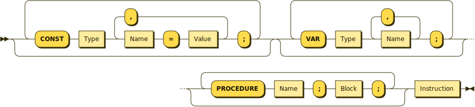
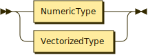
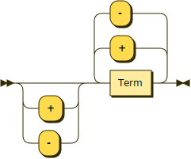
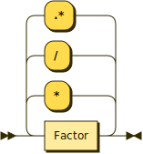
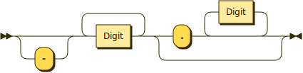

**Program:**


```
Program  ::= 'PROGRAM' Name ';' Block '.' .
```

**Block:**



```
Block    ::= ( 'CONST' Name '=' Number ( ',' Name '=' Number )* ';' )? ( 'VAR' Type Name ( ',' Name )* ';' )? ( 'PROCEDURE' Name ';' Block ';' )* Instruction .
```

referenced by:

* Block
* Program

**Type:**



```
Type     ::= ( 'INT8' | 'INT16' | 'INT32' | 'INT64' | 'INT128' | 'FLOAT8' | 'FLOAT16'
                  | 'FLOAT32' | 'FLOAT64' | 'FLOAT128' ) ( ( MatrixType? '[' Size ']' )? '[' Size ']' )*
```

referenced by:

* Block

**MatrixType:**


```
MatrixType
         ::= 'SPARSE'
           | 'IDENTITY'
           | 'DIAGONAL'
           | 'UPPERTRIANGULAR'
           | 'LOWERTRIANGULAR'
           | 'ORTHOGONAL'
```

referenced by:

* Type

**Instruction:**


```
Instruction
         ::= ( ( Name '=' | 'WRITE' ) Expression | ( 'CALL' | 'READ' ) Name | 'BEGIN' Instruction ( ';' Instruction )* 'END' | ( 'IF' Condition 'THEN' | 'WHILE' Condition 'DO' ) Instruction ) .
```

referenced by:

* Block
* Instruction

**Condition:**


```
Condition
         ::= Expression ( ( '<' | '>' ) '='? | '==' ) Expression
           | 'NOT' Condition .
```

referenced by:

* Condition
* Instruction

**Expression:**



```
Expression
         ::= ( '+' | '-' )? Term ( ( '+' | '-' ) Term )* .
```

referenced by:

* Condition
* Factor
* Instruction

**Term:**



```
Term     ::= Factor ( ( '*' | '/' ) Factor )* .
```

referenced by:

* Expression

**Factor:**


```
Factor   ::= Name
           | Number
           | '(' Expression ')' .
```

referenced by:

* Term

**Letter:**


```
Letter   ::= 'A'
           | 'B'
           | 'C'
           | 'D'
           | 'E'
           | 'F'
           | 'G'
           | 'H'
           | 'I'
           | 'J'
           | 'K'
           | 'L'
           | 'M'
           | 'N'
           | 'O'
           | 'P'
           | 'Q'
           | 'R'
           | 'S'
           | 'T'
           | 'U'
           | 'V'
           | 'W'
           | 'X'
           | 'Y'
           | 'Z'
           | 'a'
           | 'b'
           | 'c'
           | 'd'
           | 'e'
           | 'f'
           | 'g'
           | 'h'
           | 'i'
           | 'j'
           | 'k'
           | 'l'
           | 'm'
           | 'n'
           | 'o'
           | 'p'
           | 'q'
           | 'r'
           | 's'
           | 't'
           | 'u'
           | 'v'
           | 'w'
           | 'x'
           | 'y'
           | 'z'
```

referenced by:

* Name

**Digit:**


```
Digit    ::= '0'
           | '1'
           | '2'
           | '3'
           | '4'
           | '5'
           | '6'
           | '7'
           | '8'
           | '9'
```

referenced by:

* Name
* Number

**Name:**


```
Name     ::= Letter ( Letter | Digit | '_' )*
```

referenced by:

* Block
* Factor
* Instruction
* Program

**Number:**



```
Number   ::= '-'? Digit+ '.'? Digit*
```

referenced by:

* Block
* Factor

## 
 <sup>generated by [RR - Railroad Diagram Generator][RR]</sup>

[RR]: https://www.bottlecaps.de/rr/ui